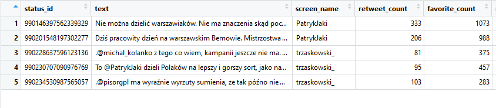
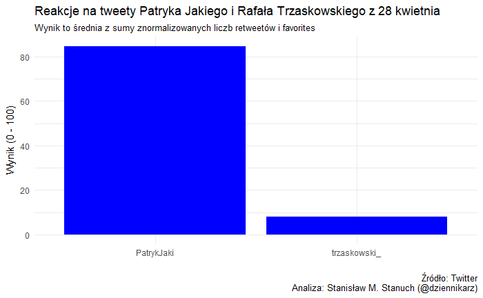

Pomiar zaangażowania w social mediach to nie jest jak się niektórym wydaje trywialna rzecz. Amatorzy najczęściej stosują proste, dostępne dla każdego wskaźniki, jak liczba lajków. Tymczasem rzecz jest trochę bardziej skomplikowana.  
Internauta na Twitterze ma praktycznie cztery możliwości wyrażenia swojego stosunku do tego co opublikował polityk.

- Pierwsza, najprostsza to **danie lajka**. Lajk mówi: podoba mi sie...i tylko tyle. Z liczby lajków polityk może najwyżej dowiedzieć się, które tematy podobają się użytkownikom. Ale polityk z pewnością nie tylko po to publikuje by np. sprawdzić czy to co pisze, cieszy się popualrnością, ale również chciałby, by jego publikacje były dalej przesyłane, bo dzięki temu ma  - mówiąc wprost - darmową reklamę. **Lajk nie powoduje, że publikacja będzie się dalej rozprzestrzeniać**, a więc - z jego punktu widzenia - jest miłą, bo łechcącą próżność rzeczą, ale z  pragmatycznie, niewiele daje.

- Z pewnością zdecydowanie **cenniejszy jest retweet**, czyli przesłanie tweeta, do swoich followersów. Dzieki temu po pierwsze, **zwiększa się zasięg tweeta** (więcej ludzi go obejrzy), a więc polityk osiąga to co zamierzał. Po drugie - retweet też oznacza poparcie, bo chociaż zdarza się, to jednak niezwykle rzadko, że retweetujemy treść, z którą się nie zgadamy.

- Trzecią formą reakcji jest **odpowiedź na tweeta**. Jest to rzecz, którą do niedawna analitycy Twittera trochę pomijali, a teraz wręcz przeciwnie, przykładają do liczby reply, dużą wagę. Dlaczego? Bo reply najczęściej jest odwrotnością lajka, czyli w ten sposób - jedyny na Twitterze - internauci **mogą wyrazić, że się z czymś nie zgadają**. 

- No i ostatnią formą jest... **brak reakcji**. Niezwykle trudno to  wiarygodnie zmierzyć, bo zależy od wielu czynników np. godziny czy dnia tygodnia w których opublikowano tweet.

W tym tekście zajmę się dwoma pierwszymi reakcjami czyli lajkami i retweetami. Pokażę jak na ich podstawie zmierzyć obiektywną reakcję na publikację polityka. Za dane posłużą mi dwa opublikowane wczoraj tweety Patryka Jakiego i Rafała Trzaskowskiego.

UWAGA (Edycja 3 sierpnia 2018.)
Patryk Jaki skasował swój tweet, ale w internecie nic nie ginie, więć jego treść jest w formie graficznej :-)


```{r echo=FALSE}
# blogdown::shortcode('tweet', '990146397562339329')
blogdown::shortcode('tweet', '990230707090976769')

```

Kiedy piszę te słowa tweet Jakiego był retweetowany 333 razy i lajkowany 1027 razy. Tweet Trzaskowskiego odpowiednio 95 i 457 razy. Nie trzeba specjalnie wiele liczyć, by stwierdzić, że pod każdym względem więcej było reakcji na tweet Jakiego. Chciałbym jednak na tym przykładzie pokazać metodę, którą stosuję, bo nie zawsze wyniki są tak jednoznaczne i widać je gołym okiem.

Najprościej zaanagażowanie zmierzyć sumując liczbę retweetów i lajków. Sposób prosty ale zawodny bo po pierwsze, z czym zgodzą się chyba wszyscy, retweet jest o wiele cenniejszy, a co za tym idzie rzadszy, niż lajk. Po drugie duża liczba lajków - a tak często jest, że jest ich więcej niż retweetów - ma ogromny wpływ na wynik końcowy. By zniweczyć niekorzystny wpływ jednej zmiennej najlepiej jest, by wartości znajdowały się w jednym zakresie liczb. Metoda sprowadzenia wyników do takiej postaci nazywa się normalizacja i stosuje ją np. Google Trends w swoich analizach.

Normalizować można do różnych zakresów np. 0 do 1, ale tu wygodniej będzie zastosować zakres od 0 do 100. Po prostu łątwiej wówczas wyniki zapamietać.  Znormalizowanie wyniku to obliczenie liczby w zakresie od 0 do 100 dla wybranej wartości. Robi się to bardzo prosto i w pojedycznych wypadkach, każdy, kto posiada odpowiednie dane, może to zrobic ręcznie albo w arkuszu kalkulacyjnym. Tak naprawdę do przeprowadzenia normalizacji tweetów tych dwóch polityków potrzebujemy liczby retweetów i favorites wszystkich ich tweetów  

Ja zrobiłem to dla jednego dnia. 
Do normalizacji stosuje się wzór (tu dla retweetów):

Xnr = 100 * (Xr - min(Xwszystkichr)) / (max(Xwszystkichr) - min(Xwszystkichr))

Czyli zobaczmy to dla tweeta Jakiego, który miał wynik 333 retweetów:

Xnr = 100 * (333 - 81) / (333-81).

Jak sobie to policzyćie, to wyjdzie Wam 100. Dlaczego? Bo normalizacja właśnie na tym polega, że najlepszemu wynikowi w zbiorze liczb przypisuje się najwyższą możliwą liczbę - w tym wypadku 100. Analogicznie wynik Trzaskowskiego (81) to 0, bo jest to najniższy wynik w tym zbiorze. Reszta będzie gdzię między tymi wartościami. 

W identyczny sposób liczymy znormalizowany wynik dla każdego tweeta dla lajków. W efekcie otrzymujemy dwie liczby (dla każdego tweeta), które mieszczą się w zakresie od 0 do 100. Zaletą ich jest, że są na tej samej skali czyli łatwiej je porównać. 

By otrzymać ostateczny wynik dla konkretnego tweeta, sumuję znormalizowane wyniki retweetów i lajków i tą sumę  dzielę na 2 (bo mam dwie liczby). Znowu osiągam jakiś wynik w przedziale od 0 do 100. Dla tweeta Jakiego jest to 100, bo tak się składa, że jego tweet miał też najwyższą liczbę lajków, czyli (100 + 100)/2 to jest 100. Dla Trzaskowskiego jest to 5.822785 czyli dużo, dużo mniej. 

By mieć obraz całości reakcji na tweety Jakiego i Trzaskowskiego w wybranym dniu wyciągnąłem średnią z ich wyników i na tej podstawie stworzyłem wykres, który pokazuje to co widać też w liczbach: że tweety Patryka Jakiego - przynajmniej te z 28 kwietnia 2018 wywołały o wiele większe zaangażowanie, niż jego przeciwnika Rafała Trzaskowskiego.



